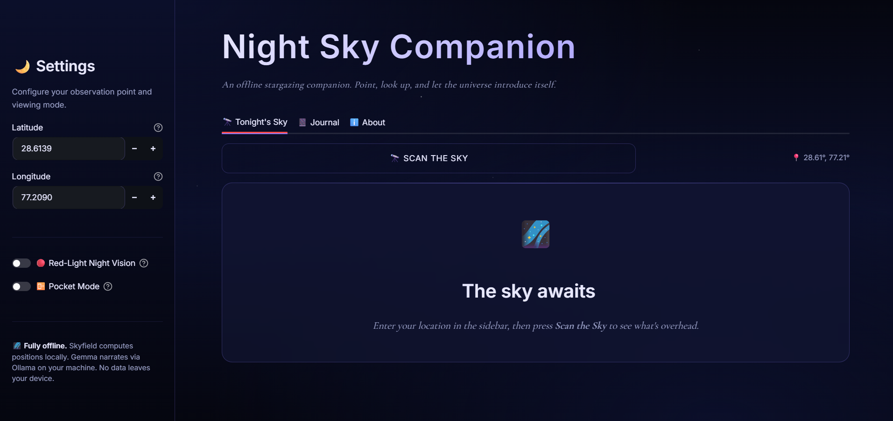

<div align="center">

# 🌙 Night Sky Companion

### *Your sky. Your AI. Your laptop. Nobody else's.*

A fully offline constellation spotter that runs **100% on your machine**.
Enter your location, press one button, and it tells you what's above your head
right now — constellations, bright stars, moon phase — narrated by an open-weight
LLM. **No internet. No API keys. No servers.**

<br />

[](https://python.org)
[](https://streamlit.io)
[](https://rhodesmill.org/skyfield)
[](https://ollama.com)
[](https://ai.google.dev/gemma)
[](LICENSE)

<br />

[💡 Why](#-why-i-built-this) · [✨ Features](#-features) · [🎬 Demo](#-demo) · [🚀 Quick Start](#-quick-start) · [🧠 How It Works](#-how-it-works) · [🌍 Open AI](#-why-open-innovation-matters) · [🎃 Hacktoberfest](#-hacktoberfest-2026)

</div>

---

<div align="center">

## 💡 Why I Built This

</div>

> [!IMPORTANT]
> *"I love stargazing but I never know what I'm looking at.*
> *Every app I tried wants my location, my data, and an internet connection —*
> *but the best skies are the ones with no signal."*
>
> — **Me, on a trail at 2 a.m.**

The best stargazing spots have no cell signal. That's the whole point — dark skies are far from cities and cell towers. But every astronomy app I tried needed the internet to work.

So I built something better.

**Night Sky Companion** gives you real astronomy, real mythology, and real "look here" directions with **zero internet required**. It computes star positions with an open-source library, narrates them with an open-weight model running locally, and then tells you to **put your phone down and look up**.

This isn't an app that wants your attention. It's an app that wants to give it back.

---

<div align="center">

## ✨ Features

</div>

| &nbsp;&nbsp;🔭&nbsp;&nbsp; | **Offline Sky Scan** — Computes which constellations are overhead from your lat/lon, right now. |
|:---:|---|
| &nbsp;&nbsp;🌕&nbsp;&nbsp; | **Moon Phase** — Illumination % plus stargazing advice tuned to how dark the sky will be. |
| &nbsp;&nbsp;⭐&nbsp;&nbsp; | **Bright Stars** — Lists the brightest stars above your horizon with altitude and compass direction. |
| &nbsp;&nbsp;🔴&nbsp;&nbsp; | **Red-Light Mode** — Scotopic red palette preserves your dark adaptation. A stargazing tradition. |
| &nbsp;&nbsp;📴&nbsp;&nbsp; | **Pocket Mode** — Actively tells you to stop looking at the screen. The sky will wait. |
| &nbsp;&nbsp;📔&nbsp;&nbsp; | **Sky Journal** — Logs every observing session locally. Your data never leaves your device. |
| &nbsp;&nbsp;🧠&nbsp;&nbsp; | **Open-Weight AI** — Gemma 2 narrates mythology and "look here" tips. Swap the model in one line. |

---

<div align="center">

## 🎬 Demo



*Red-light mode active. The app computes 15 constellations, the moon phase, and narrates Andromeda's mythology — all offline.*

</div>

---

<div align="center">

## 🧰 Tech Stack

| 🧩 Layer | 🛠️ Tool | 🎯 Purpose |
|:---:|:---:|:---|
| **Astronomy Engine** | [Skyfield](https://rhodesmill.org/skyfield) | Precise star, planet, and constellation positions |
| **Ephemeris** | JPL DE421 | Bundled orbital data — no network needed |
| **Star Catalog** | Hipparcos | 118,000 stars (public domain) |
| **AI Runtime** | [Ollama](https://ollama.com) | Runs LLMs locally on any machine |
| **Model** | [Gemma 2 (2B)](https://ai.google.dev/gemma) | Google's open-weight model |
| **UI** | [Streamlit](https://streamlit.io) | Beautiful web UI in pure Python |
| **Language** | [Python 3.11+](https://python.org) | Glues it all together |

</div>

---

<div align="center">

## 🚀 Quick Start

*From zero to stargazing in under 5 minutes.*

</div>

**1. Install Ollama** — [ollama.com/download](https://ollama.com/download)

**2. Download the model**
```bash
ollama pull gemma2:2b
