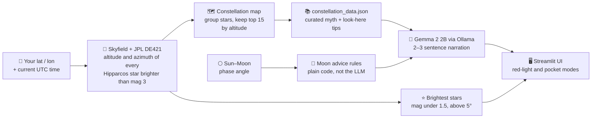

<div align="center">



<br/>

**A fully offline constellation spotter that runs on your machine.**
Enter your location, press one button, and it tells you what is above your head *right now*:
constellations, bright stars and the moon, narrated by an open-weight LLM running locally.

**No API keys. No servers. No tracking. No internet once set up.**

<br/>

[](https://python.org)
[](https://streamlit.io)
[](https://rhodesmill.org/skyfield)
[](https://ollama.com)
[](https://ai.google.dev/gemma)
[](LICENSE)
[](#-hacktoberfest-2026)

<br/>

[💡 Why](#-why-i-built-this) ·
[✨ Features](#-features) ·
[🎬 Demo](#-demo) ·
[🔭 How It Works](#-how-it-works) ·
[🚀 Quick Start](#-quick-start) ·
[🌠 How to Use](#-how-to-use) ·
[🎨 Customise](#-make-it-yours) ·
[🌍 Open AI](#-why-open-innovation-matters) ·
[🎃 Hacktoberfest](#-hacktoberfest-2026)

</div>

---

## 💡 Why I Built This

> [!IMPORTANT]
> *"I'm standing on a ridge in the Himalayas.
> Zero cell signal. The Milky Way is so bright it casts shadows.
> I want to know what I'm looking at, but every app I have
> needs an internet connection to tell me."*
>
> — **Me, on a cold October night**

The best stargazing spots have no signal. That is the whole point of them: far from cities, far from light pollution, far from cell towers. Yet every astronomy app I tried wanted my location, my data and a working connection just to name a star.

So I built something better. **Night Sky Companion** gives you real astronomy, real mythology and real "look here" directions with **no connection needed**. An open-source astronomy library computes where the stars are, an open-weight LLM narrates them, and all of it happens on your laptop.

Then it tells you to **put the screen down and look up**, because that is the whole point.

*This isn't an app that wants your attention. It's an app that wants to give it back.*

---

## ✨ Features

| | Feature | What it does |
|:---:|---|---|
| 🔭 | **Offline Sky Scan** | Works out which constellations are above your horizon from your latitude / longitude and the current time |
| ⭐ | **Bright Stars** | Lists the brightest stars up right now, with altitude and compass direction |
| 🌕 | **Moon Phase** | Illumination % from the Sun–Moon geometry, plus stargazing advice tuned to how dark the sky really is |
| 🧠 | **Open-Weight AI Narration** | Gemma 2 (via Ollama) turns curated mythology and "look here" tips into a short, warm, personal narration |
| 🔴 | **Red-Light Mode** | A deep-red palette that protects your dark adaptation, a stargazing tradition |
| 📴 | **Pocket Mode** | A gentle nudge to pocket your device and look up. The sky will wait |
| 📔 | **Sky Journal** | Logs the constellations from each scan so you can look back over your session |
| 🎨 | **Glassmorphism UI** | A cinematic dark theme made to be looked at *briefly* and then put away |
| 🛟 | **Graceful fallbacks** | Ollama not running? You still get the curated mythology and directions. The app never dead-ends |

---

## 🎬 Demo

<div align="center">


*The home screen: set your observation point in the sidebar, flip the night-vision toggles, press **Scan the Sky**.*

</div>

**What one scan gives you**

| Output | Detail |
|---|---|
| 🗺️ **Constellations overhead** | Up to the **15 highest** constellations that have bright stars above your horizon |
| 📖 **Narrated stories** | The **top 5** get a mythology + "look here" narration |
| ⭐ **Bright stars** | The **10 brightest** stars (magnitude below 1.5) that are more than 5° above the horizon |
| 🌙 **Moon** | Phase name, illumination % and a one-line, plain-language observing tip |
| 🧭 **Directions** | Compass direction plus altitude in degrees, so you know where *and* how high to look |

---

## 🔭 How It Works

Every scan runs entirely on your device.



### 🧱 A design rule worth stealing: *code decides the facts, the LLM only phrases them*

Small local models are charming storytellers and unreliable fact-checkers. So the heavy lifting is done by deterministic code and curated data:

- **Positions, constellations and moon phase** come from Skyfield, never from the model.
- **Mythology and "look here" tips** come from a hand-written `constellation_data.json`. The model is handed them and asked to *rewrite* them warmly, so it has nothing to invent.
- **Moon advice** (bright / moderate / dark skies) is chosen by simple thresholds in code. The LLM only rephrases it in under 25 words.

### 🛟 If something is missing

| Situation | What happens |
|---|---|
| Ollama isn't running, or the model isn't pulled | The narration falls back to the curated myth + directions text |
| A constellation isn't in the curated database | A generic "look toward the *direction*, about *N*° above the horizon" line |
| No internet (after first-time setup) | Everything keeps working. That's the point |

---

## 🧰 Tech Stack

| Layer | Tool | Purpose |
|---|---|---|
| **Astronomy engine** | [Skyfield](https://rhodesmill.org/skyfield) (MIT) | Precise star, Moon and Sun positions |
| **Ephemeris** | [JPL DE421](https://naif.jpl.nasa.gov/pub/naif/generic_kernels/spk/planets/) | Planetary orbital data, downloaded once then cached |
| **Star catalogue** | [Hipparcos](https://en.wikipedia.org/wiki/Hipparcos) (ESA) | ~118,000 stars, downloaded once then cached |
| **AI runtime** | [Ollama](https://ollama.com) | Runs LLMs locally on ordinary hardware |
| **Model** | [Gemma 2 (2B)](https://ai.google.dev/gemma) | Google's open-weight model, small enough for a laptop |
| **UI** | [Streamlit](https://streamlit.io) (Apache 2.0) | Instant web interface in pure Python |
| **Language** | Python 3.11+ | Glues it together |

---

## 🚀 Quick Start

*From zero to stargazing in about five minutes.*

> [!NOTE]
> **Set up once online, then go offline forever.** Two things are downloaded on first use: the Gemma model (step 2) and the Skyfield data files (your first scan). After that, no connection is needed.

**1. Install Ollama** from [ollama.com/download](https://ollama.com/download) and make sure it is running.

**2. Download the model** (one time)

```bash
ollama pull gemma2:2b
```

**3. Clone the project and install dependencies**

```bash
git clone https://github.com/vaibhav7549/Night-Sky-Companion.git
cd Night-Sky-Companion

python -m venv venv
source venv/bin/activate          # Windows: venv\Scripts\activate
pip install -r requirements.txt
```

**4. Launch**

```bash
streamlit run app.py
```

Your browser opens the app. Press **🔭 Scan the Sky**. The **first scan** takes a little longer because Skyfield downloads `de421.bsp` and the Hipparcos catalogue into the folder you launched from. Every scan after that is fully local.

### 🏔️ Before you head to the dark-sky site

Do a **dry run at home, with Wi-Fi**:

- [ ] `ollama pull gemma2:2b` has finished
- [ ] You have pressed **Scan the Sky** at least once (this caches the Skyfield data)
- [ ] You launch the app **from the same project folder** (that's where the data files live)
- [ ] Battery charged. Red-light mode on. Screen brightness at the minimum

---

## 🌠 How to Use

1. **Set your location** in the sidebar. The defaults are New Delhi (28.6139, 77.2090). Use decimal degrees: **north and east are positive**, so south and west are negative.
2. **Pick your viewing mode**
   - 🔴 **Red-Light Night Vision** switches the whole UI to a red palette so your eyes stay dark-adapted.
   - 📴 **Pocket Mode** shows a "put your phone away and look up" banner under your results.
3. Press **🔭 Scan the Sky** on the **Tonight's Sky** tab.
4. Read the stats strip, then the narrated constellation cards. Each gives you the story, the direction and the altitude.
5. Check the **Moon** card before you plan what to hunt for. Bright moonlight washes out faint objects.
6. Open the **📔 Journal** tab to see everything you spotted this session.
7. Then **look up**. 🌌

> 💡 Not sure of your coordinates? Any maps app shows them. Note them down before you lose signal.

---

## 🎨 Make It Yours

Everything is open code, so it's easy to bend.

<details>
<summary><b>🧠 Swap the AI model</b></summary>

Narration lives in `ai_narrator.py`. Pull any model Ollama supports, then change the model name used in the two `ollama.chat(...)` calls:

```bash
ollama pull llama3.2:3b
```

```python
response = ollama.chat(model="llama3.2:3b", ...)   # was "gemma2:2b"
```

Tune `temperature` and `num_predict` in the same calls to change how creative or how long the narration is.

</details>

<details>
<summary><b>📚 Add a constellation</b></summary>

Open `constellation_data.json` and add an entry. The `abbreviation` must match Skyfield's three-letter IAU code:

```json
"Draco": {
  "abbreviation": "Dra",
  "myth": "Draco is the dragon Ladon, guardian of the golden apples of the Hesperides, slain by Heracles.",
  "look_here": "Find the long winding line of stars between the Big Dipper and Little Dipper; its head is a small, bright quadrilateral near Hercules.",
  "season": "Summer (Northern Hemisphere)"
}
```

Constellations without an entry still appear, just with the generic fallback text.

</details>

<details>
<summary><b>✍️ Change the narration voice</b></summary>

The prompt is a plain f-string in `narrate_constellation()`. Want a pirate navigator, a grandparent, or a Sanskrit-poetry tone? Edit the instructions and keep the "use only the facts provided" structure.

</details>

**📖 Currently curated (22 of the 88 IAU constellations):**
Orion · Ursa Major · Ursa Minor · Cassiopeia · Cygnus · Lyra · Aquila · Scorpius · Sagittarius · Leo · Taurus · Gemini · Canis Major · Perseus · Andromeda · Pegasus · Aries · Boötes · Corona Borealis · Canes Venatici · Hercules · Virgo

---

## 🗂️ Project Structure

```text
Night-Sky-Companion/
├── app.py                   # Streamlit UI: sidebar, tabs, themes, red-light + pocket modes
├── sky_engine.py            # Skyfield maths: visible constellations, bright stars, moon phase
├── ai_narrator.py           # Ollama + Gemma narration with graceful fallbacks
├── constellation_data.json  # Curated mythology, "look here" tips and seasons
├── requirements.txt         # streamlit, skyfield, ollama, numpy, pandas, pillow
├── screenshots/             # README images
├── assets/banner.svg        # README banner
└── LICENSE                  # MIT
```

---

## 🌍 Why Open Innovation Matters

Closed, cloud-only tools can't do this job. An astronomy companion for places with no signal *needs* to be open:

| | |
|---|---|
| 📴 **Offline capability** | Cloud APIs don't answer at a dark-sky site. Skyfield computes locally and Gemma runs through Ollama on your own machine |
| 🔒 **Privacy** | Your coordinates and observing times are processed on your device, not sent to a server |
| 💸 **Zero cost** | No API keys, no subscriptions, no usage limits |
| 🔧 **Modifiability** | Swap the model, add constellations, change the voice. It's all just code |
| 🎓 **Learnable** | A few hundred readable lines of Python. A good first project for anyone curious about local LLMs or astronomy maths |

---

## 🎃 Hacktoberfest 2026

Night Sky Companion is built for **Hacktoberfest 2026**, and contributions of every size are welcome. Pick something from the list below, or bring your own idea. Please **open an issue to claim a task first** so we don't duplicate work.

### 🪐 Good first issues

| | Task | Where | Notes |
|:---:|---|---|---|
| 🟢 | **Fix moon phase names** | `sky_engine.get_moon_phase` | Waning phases are never named, and 95%+ illumination is labelled "Waning Gibbous" instead of "Full Moon". Use the Sun–Moon angle to tell waxing from waning |
| 🟢 | **Add constellations** | `constellation_data.json` | 66 of 88 are still missing. One accurate entry is a perfectly good PR |
| 🟢 | **8-point compass** (N, NE, E, SE…) | `_dir_from_az` in `app.py`, `_azimuth_to_direction` in `ai_narrator.py` | Today it's four directions only |
| 🟢 | **Hemisphere-aware seasons** | `constellation_data.json` + UI | Seasons are labelled for the Northern Hemisphere only |
| 🟢 | **More screenshots** | `screenshots/` | Results view, red-light mode, journal tab |
| 🟡 | **Persist the journal** | `app.py` | It currently lives in session state and is lost on refresh. Save to a local JSON / SQLite file, add export |
| 🟡 | **Date & time picker** | `app.py` | `sky_engine` already accepts a `when` argument, so you can plan tomorrow night |
| 🟡 | **Model name in one place** | `ai_narrator.py` | Move `gemma2:2b` to a constant or env var, optionally with a sidebar model picker from `ollama.list()` |
| 🟡 | **Self-host the fonts** | `inject_styles` in `app.py` | The UI imports Inter and Cormorant Garamond from Google Fonts. Bundle them so there is truly zero network use |
| 🟡 | **Offline text-to-speech for Pocket Mode** | new module | Narrate results aloud with a local engine such as Piper |
| 🟡 | **Tests** | new `tests/` | `pytest` for `sky_engine` using a fixed datetime and known positions |
| 🔴 | **Planets tonight** | `sky_engine.py` | DE421 already contains Mercury to Saturn |
| 🔴 | **Sky-map chart** | `app.py` | A polar plot of what's overhead, in the red-light theme |
| 🔴 | **Speed up scans** | `sky_engine.py` | Stars are observed one by one in a Python loop. Vectorise it |
| 🔴 | **One-command install** | repo root | Dockerfile or script that wires up Ollama + the app |
| 🔴 | **Other languages** | `ai_narrator.py` | Narrate in Hindi, Spanish, Japanese and more |

### 🛠️ How to contribute

```bash
# 1. Fork the repo on GitHub, then clone your fork
git clone https://github.com/<your-username>/Night-Sky-Companion.git
cd Night-Sky-Companion

# 2. Create a branch
git checkout -b fix/moon-phase-names

# 3. Make your change and run the app to check it
streamlit run app.py

# 4. Commit, push and open a pull request
git commit -am "Fix waxing/waning moon phase names"
git push origin fix/moon-phase-names
```

### 🌌 Ground rules

1. **Offline first.** No runtime calls to external services. The only network use allowed is a one-time data download.
2. **No telemetry, no tracking, no required API keys.** Ever.
3. **Code decides the facts, the LLM phrases them.** Keep astronomy and moon logic deterministic.
4. **Keep it calm.** The UI is meant to be glanced at, not stared at. Avoid anything that competes for attention.
5. For UI changes, attach a **screenshot** to your PR.

---

## 🧭 Known Limitations

Being upfront about where the project stands today:

- **First run needs internet once.** Skyfield downloads the ephemeris and star catalogue, and Ollama downloads the model. After that it is fully offline.
- **Web fonts.** The UI requests Inter and Cormorant Garamond from Google Fonts when online and falls back to system fonts when offline. Cosmetic only, but see the self-hosting task above.
- **Journal is per-session.** It is held in memory and cleared when you refresh the page.
- **Pocket Mode is a banner for now.** Audio narration is on the wish-list.
- **Narration quality depends on the small local model.** Facts come from code and curated data, but phrasing can vary between runs.
- **Moon phase naming** has a known bug (listed above). The illumination percentage itself is computed correctly.
- **22 of 88 constellations** have curated stories. The rest get a generic direction line.

---

## 🙏 Acknowledgements

Standing on the shoulders of giants: [Skyfield](https://rhodesmill.org/skyfield) by Brandon Rhodes · [NASA JPL](https://naif.jpl.nasa.gov/) ephemerides · the [ESA Hipparcos](https://www.cosmos.esa.int/web/hipparcos) catalogue · [Ollama](https://ollama.com) · [Google Gemma](https://ai.google.dev/gemma) · [Streamlit](https://streamlit.io) · and every human who looked up and told a story about what they saw.

## 📄 License

Released under the [MIT License](LICENSE). Copyright © 2026 Vaibhav.

---

<div align="center">

**Built with 💜 for the night sky, by [@vaibhav7549](https://github.com/vaibhav7549)**

*The sky has been telling stories for ten thousand years. Go and listen.*

<sub>⭐ If this made you want to step outside and look up, a star on the repo is a lovely way to say so.</sub>

</div>
